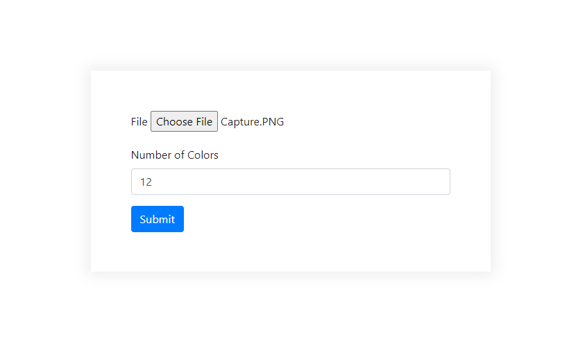
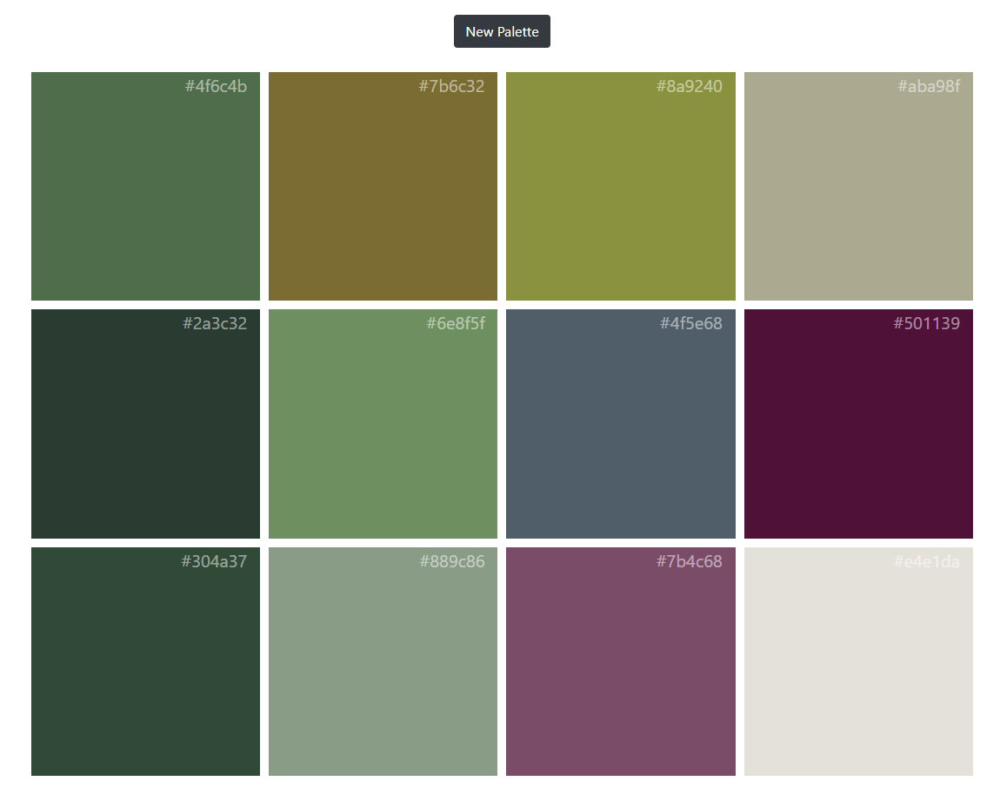

<h1 align="center">Color Palette Generator</h1>

<p align="center">
This website will generate a color palette from the image provided. </p>


## Links

- [Repo](https://github.com/kelseychristensen/Day-90-Color-Palette-Generator "palette")
- [Livelink](https://palette-generator.onrender.com/ "livelink")

## Screenshots

#### Form

#### Result


### Built with

- HTML
- CSS
- Python
- Flask
- Bootstrap
- WTForms 
- Jinja
- SQL

### What went into this project

I used the colorgram python library, Flask, Bootstrap, and WTForms to create this form that will return the user's selected number of color palette colors on form submit. 

### What I learned

About the aspect ratio CSS property! Very handy. 

### Continued development

Ideally, the grid dimensions would be a multiple of the number of colors requested (when possible), the grid would fit inside the view height, and users would be able to click each color to copy to clipboard. 

This was hard to figure out with JS. Only the first item in the list would get copied (even when clicking a link or button attached to later indexes). I tried creating an endpoint in my flask server which copied text with pyperclip, and this worked, but since the palette template is rendered on a form submit, I couldn't get that function to redirect you back to the palette page after copying your text. I also tried to have the div id be the current list item and pass that through to a JS function, but couldn't get anything to work. 


```python
@app.route('/', methods=['GET', 'POST'])
def home():
    form = Form()
    if request.method == "POST":
        filename = secure_filename(form.file.data.filename)
        form.file.data.save('static/uploads/' + filename)
        color_list = colors(f'static/uploads/{filename}', form.num_colors.data)
        return render_template('palette.html', list=color_list, number_colors=form.num_colors.data)
    return render_template("index.html", form=form)
```
```html
<div class="vh-auto">







    
        <div class="row">
    


<div class="col-3" style="background: {{ item }}">

<p style="color: rgb(255,255,255,50%">{{ item }}</p>
</div>
```
```css
.col-3 {
    aspect-ratio : 1 / 1;
    text-align: right;
}
```
## Author

Kelsey Christensen

- [Profile](https://github.com/kelseychristensen "Kelsey Christensen")
- [Email](mailto:kelsey.c.christensen@gmail.com?subject=Hi "Hi!")
- [Dribble](https://dribbble.com/kelseychristensen "Hi!")
- [Website](http://kelseychristensen.com/ "Welcome")
